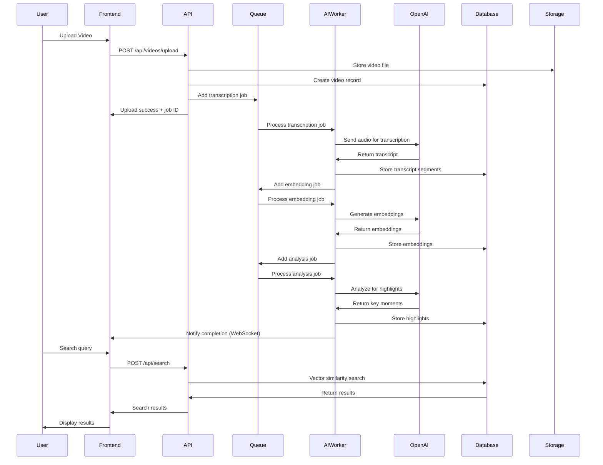
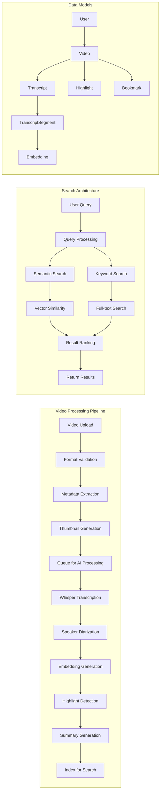

# AI-Powered Clip Curator - System Architecture Diagram

## High-Level System Architecture

```mermaid
graph TB
    %% User Interface Layer
    subgraph "Frontend Layer"
        UI[Next.js Frontend]
        PWA[Progressive Web App]
        Mobile[Mobile Interface]
    end

    %% API Layer
    subgraph "API Layer"
        API[Next.js API Routes]
        Auth[Authentication Service]
        Upload[File Upload API]
        Search[Search API]
        Stream[Video Streaming API]
    end

    %% Core Services
    subgraph "Core Application Services"
        VideoMgmt[Video Management Service]
        TranscriptSvc[Transcript Service]
        SearchSvc[Search Service]
        HighlightSvc[Highlight Service]
        UserMgmt[User Management]
    end

    %% AI Processing Pipeline
    subgraph "AI Processing Pipeline"
        Queue[Redis Job Queue]
        Worker1[Transcription Worker]
        Worker2[Analysis Worker]
        Worker3[Embedding Worker]
        AIOrch[AI Orchestrator]
    end

    %% External AI Services
    subgraph "AI Services"
        Whisper[OpenAI Whisper API]
        GPT[GPT-4 API]
        Embeddings[OpenAI Embeddings]
        LocalAI[Local Whisper Docker]
    end

    %% Data Layer
    subgraph "Data Storage"
        DB[(PostgreSQL + pgvector)]
        Redis[(Redis Cache)]
        FileStore[File Storage S3/Local]
        VideoStore[Video Storage CDN]
    end

    %% External Integrations
    subgraph "External Services"
        CDN[Content Delivery Network]
        Monitoring[Monitoring & Analytics]
        Backup[Backup Services]
    end

    %% User Flow Connections
    UI --> API
    PWA --> API
    Mobile --> API

    %% API to Services
    API --> Auth
    API --> VideoMgmt
    API --> TranscriptSvc
    API --> SearchSvc
    API --> HighlightSvc
    API --> UserMgmt

    %% Upload Flow
    Upload --> Queue
    Queue --> Worker1
    Queue --> Worker2
    Queue --> Worker3

    %% AI Processing Flow
    Worker1 --> Whisper
    Worker1 --> LocalAI
    Worker2 --> GPT
    Worker3 --> Embeddings
    AIOrch --> Queue

    %% Data Flow
    VideoMgmt --> DB
    VideoMgmt --> FileStore
    TranscriptSvc --> DB
    SearchSvc --> DB
    SearchSvc --> Redis
    HighlightSvc --> DB
    UserMgmt --> DB

    %% Storage Connections
    FileStore --> VideoStore
    VideoStore --> CDN
    Stream --> CDN

    %% Monitoring
    API --> Monitoring
    Worker1 --> Monitoring
    Worker2 --> Monitoring
    Worker3 --> Monitoring

    %% Backup
    DB --> Backup
    FileStore --> Backup

    %% Styling
    classDef frontend fill:#e1f5fe
    classDef api fill:#f3e5f5
    classDef service fill:#e8f5e8
    classDef ai fill:#fff3e0
    classDef data fill:#fce4ec
    classDef external fill:#f1f8e9

    class UI,PWA,Mobile frontend
    class API,Auth,Upload,Search,Stream api
    class VideoMgmt,TranscriptSvc,SearchSvc,HighlightSvc,UserMgmt service
    class Queue,Worker1,Worker2,Worker3,AIOrch,Whisper,GPT,Embeddings,LocalAI ai
    class DB,Redis,FileStore,VideoStore data
    class CDN,Monitoring,Backup external
```

## Data Flow Architecture

## Component Architecture Details

## Technology Stack Breakdown

### Frontend Layer
- **Next.js 14+**: React framework with SSR/SSG
- **TypeScript**: Type safety and better DX
- **Tailwind CSS**: Utility-first styling
- **Zustand**: State management
- **Video.js**: Video player component

### Backend Services
- **Next.js API Routes**: RESTful API endpoints
- **Prisma ORM**: Database abstraction layer
- **NextAuth.js**: Authentication and session management
- **Multer**: File upload handling

### AI & Processing
- **OpenAI Whisper**: Speech-to-text transcription
- **OpenAI GPT-4**: Content analysis and summarization
- **OpenAI Embeddings**: Semantic search vectors
- **Local Whisper**: Fallback transcription service
- **Bull Queue**: Job processing with Redis

### Data Storage
- **PostgreSQL**: Primary database
- **pgvector**: Vector similarity search extension
- **Redis**: Caching and job queue
- **S3/Local Storage**: Video file storage
- **CDN**: Video content delivery

### Infrastructure
- **Docker**: Containerization
- **Docker Compose**: Multi-service orchestration
- **Nginx**: Reverse proxy and load balancing
- **PM2**: Process management

## Scalability Considerations

1. **Horizontal Scaling**: AI workers can be scaled independently
2. **Database Optimization**: Read replicas for search queries
3. **CDN Integration**: Global video delivery
4. **Caching Strategy**: Multi-layer caching (Redis, CDN, browser)
5. **Queue Management**: Separate queues for different job types
6. **Microservices**: Services can be extracted as separate containers

## Security Architecture

1. **Authentication**: JWT tokens with refresh mechanism
2. **Authorization**: Role-based access control
3. **File Upload**: Virus scanning and format validation
4. **API Security**: Rate limiting and input validation
5. **Data Encryption**: At-rest and in-transit encryption
6. **Privacy**: User data isolation and GDPR compliance
